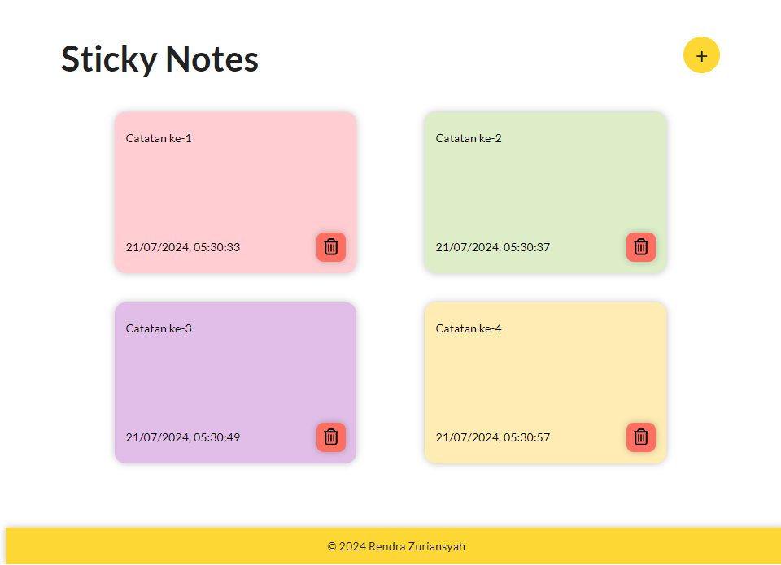
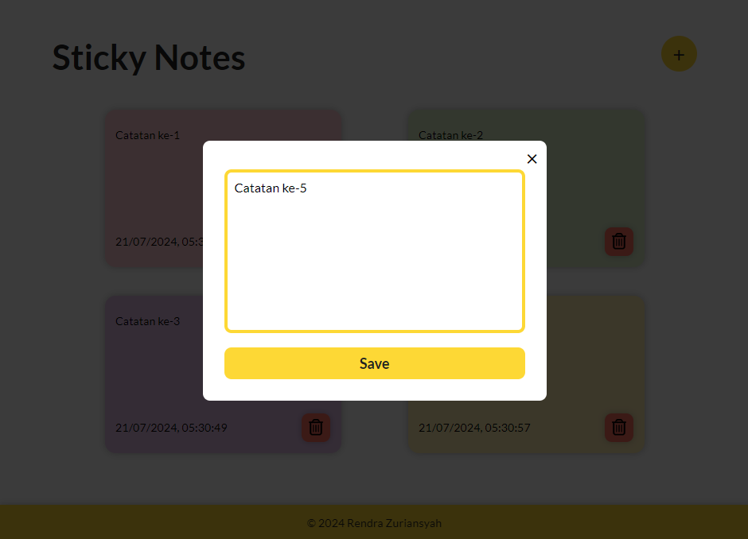

# Sticky Notes

A simple sticky notes app built with Vue 3 and Vite.

## Features

-   Add a new memo by clicking the "+" button.
-   Delete a memo by clicking the "x" button.
-   Edit a memo by clicking on it.
-   The app will save the memos to local storage.

## How to use

1. Clone the repository.
2. Run `npm install` to install the dependencies.
3. Run `npm run dev` to start the development server.
4. Open the app in your browser at `http://localhost:5173`.
5. Start adding memos!

## Screenshots

